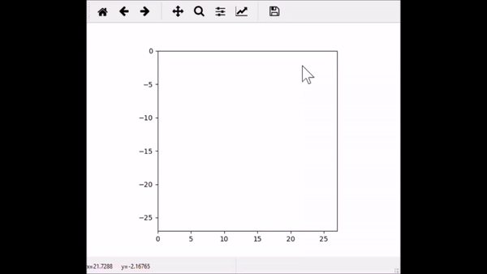
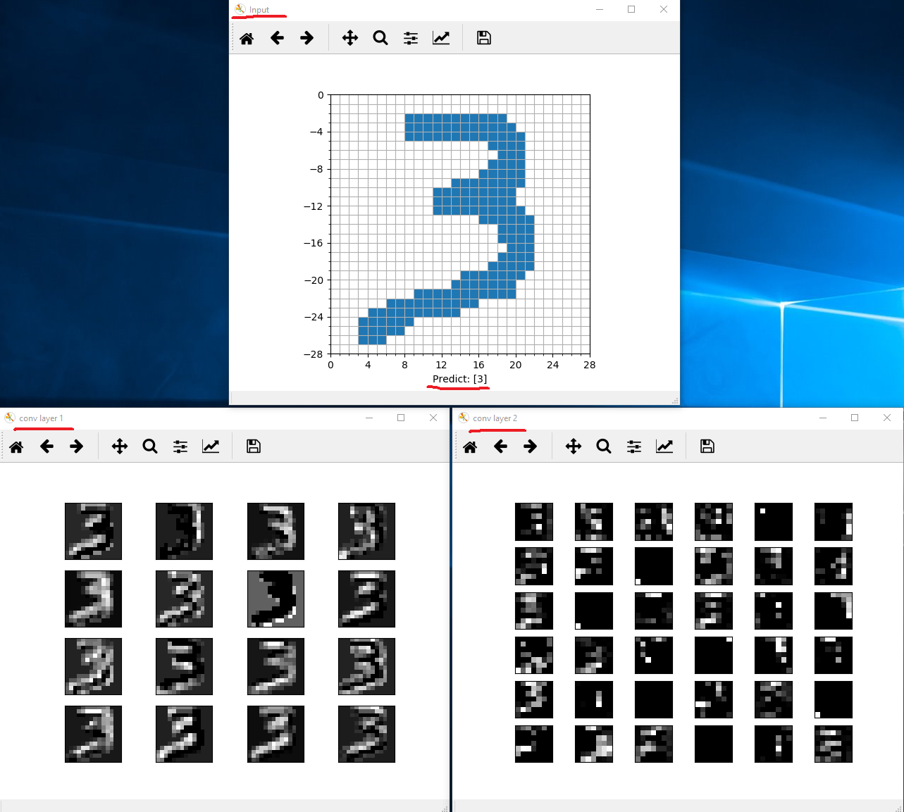
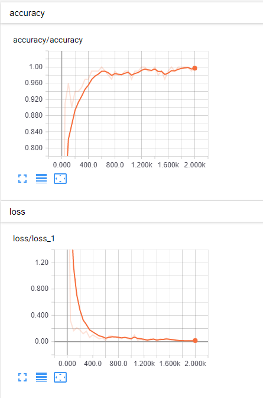
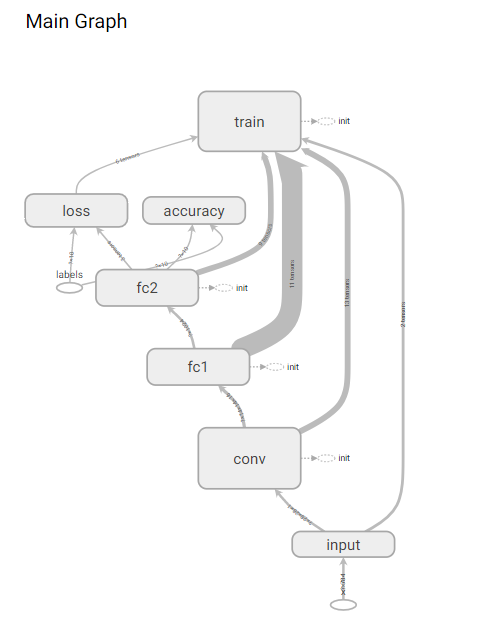
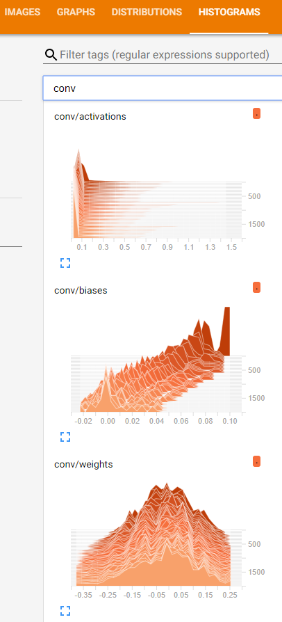

# mnist
Recognize handwritten digits in real time.

## Working like this:

## Show all detail of CNN layer

## Full tensorboard support:

## Quick start
- install python
- install python packages: numpy matplotlib
- install tensorflow
- run: python mnist.py
- run: python demo.py
